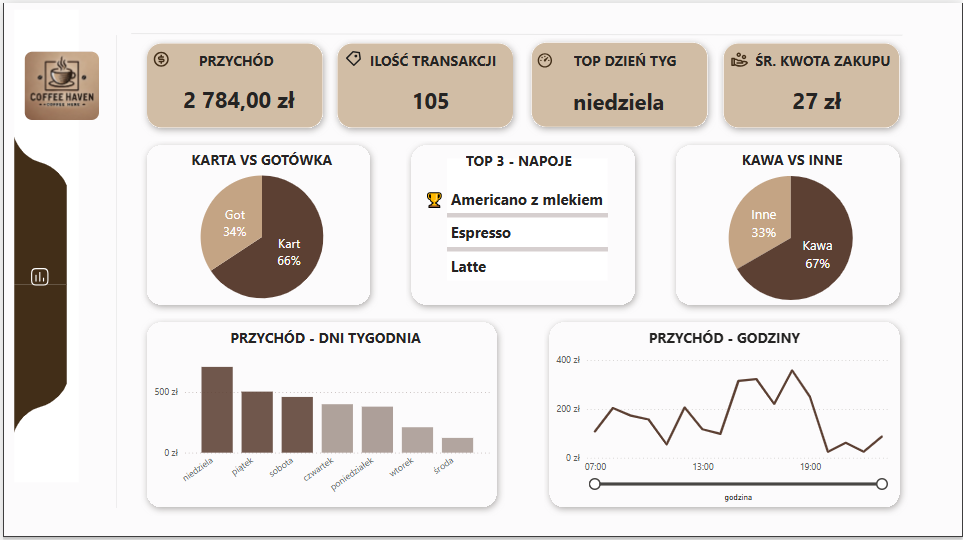
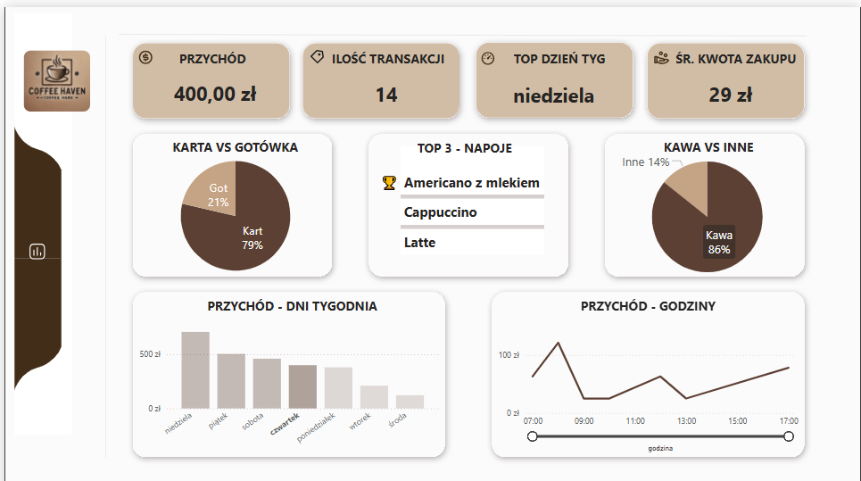

# 📈 Dashboard Sprzedaży Kawiarni

## 🎯 Cel projektu
Dostarczenie interaktywnego, szybkiego i przejrzystego podglądu sprzedaży w kawiarni, wspierając podejmowanie lepszych decyzji biznesowych.

## 🛠 Użyte narzędzia
- **Microsoft PowerBI** – dashboard
- **Microsoft PowerQuery** – czyszczenie danych
- **Figma** – strona wizualna dashboardu

## ⚙️ Kluczowe funkcje
- **Monitorowanie wyników sprzedaży**: Prezentacja kluczowych wskaźników KPI (przychód, liczba transakcji, średnia wartość zamówienia).
- **Identyfikacja najlepszego dnia tygodnia**: Wskazuje, w które dni kawiarnia generuje największe zyski.
- **Analiza metod płatności**: Wskaźnik "*Karta vs Gotówka*" pomaga zrozumieć dominującą formę płatności.
- **Najpopularniejsze napoje**: Lista TOP 3 najczęściej zamawianych napojów umożliwia lepsze planowanie promocji i dostosowywanie oferty.
- **Podział sprzedaży**: Wykres "*Kawa vs Inne*" określa, czy głównym źródłem przychodów są kawy, czy inne produkty.
- **Analiza sprzedaży w czasie**: Wykresy "*Przychód - Dni tygodni*" oraz "*Przychód - Godziny*" pokazują, kiedy sprzedaż jest najwyższa.

## 💡 Wnioski i rekomendacje
Dzięki wdrożonym funkcjom możliwe jest:
- Dostosowanie godzin pracy,
- Wprowadzanie promocji w słabszych godzinach.
